# Winamp to Spotify Web Project Version
Winamp to Spotify : Select your mp3 archieve folder and see the magic :)
The aim of this side project is collecting mp3 filenames from harddisk and create Spotify Playlist based on selected folder. To use this you need a Spotify Developer Account. To use the Web API, start by creating a Spotify user account (Premium or Free). To do that, simply sign up at https://developer.spotify.com/dashboard After creating a spotify developer account you should register an application through Dashboard.
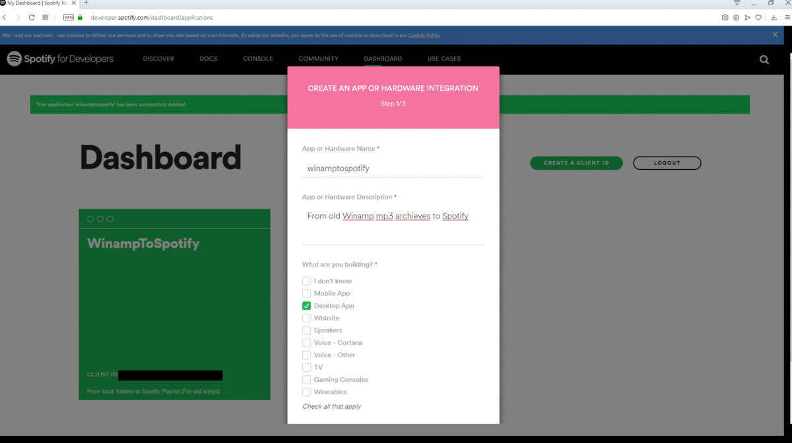 

After doing these 3 step your application should be created successfully.
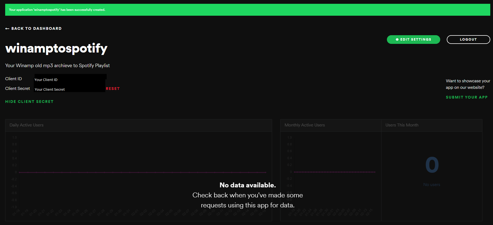

After creating you will have ClientID and Client Secret values. After creating app from Edit Settings tab you should set Redirection URLs.
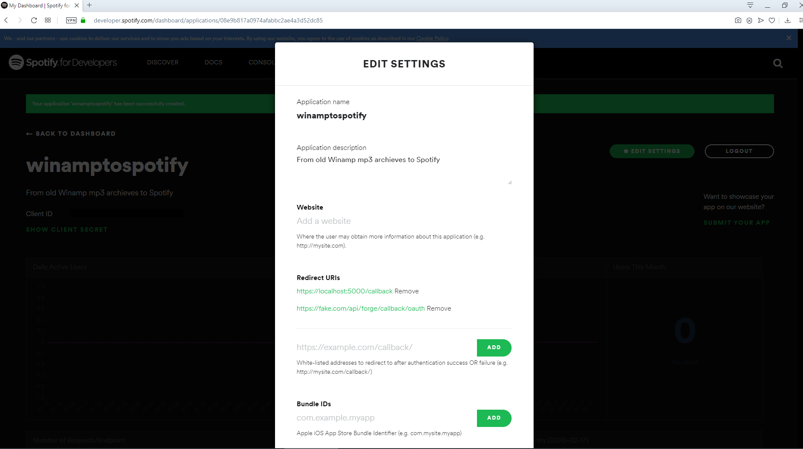

By using https://developer.spotify.com/console/get-current-user/ link you can get your UserID of Spotify User ID.
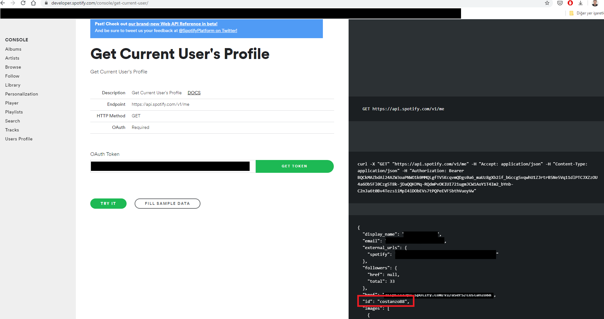

ClientID, SecretID and UserID should be placed in appsettings.json
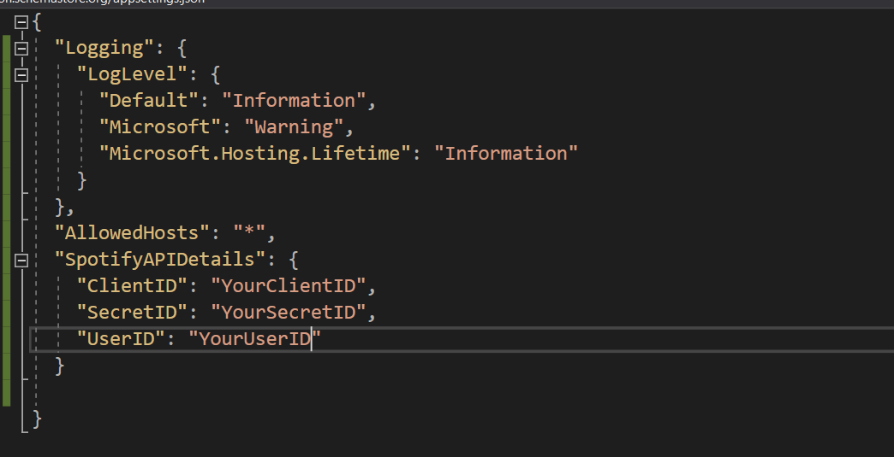
You can run project by opening solution file(.sln) with Visual Studio or Rider
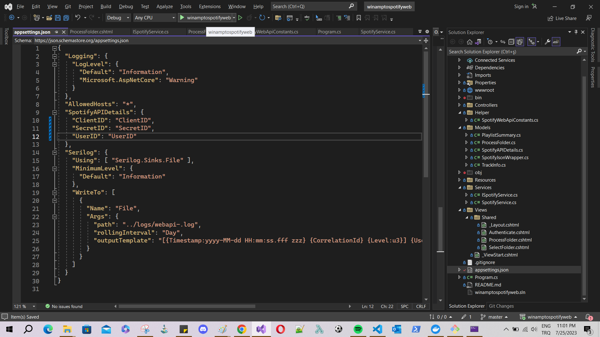
After running webspotify project http://localhost:5000 welcomes you
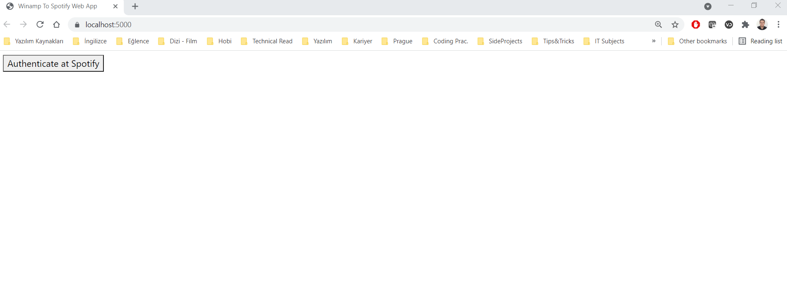
Selecting example folder as D:\Müzik Arşivi\Yabancı\Evanescence 
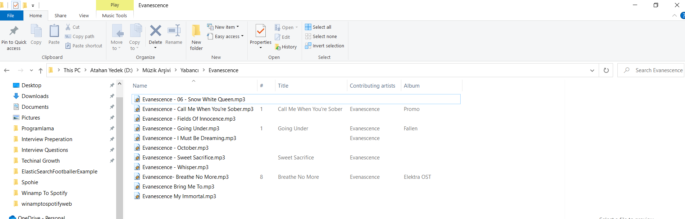
Submit process folder clicked
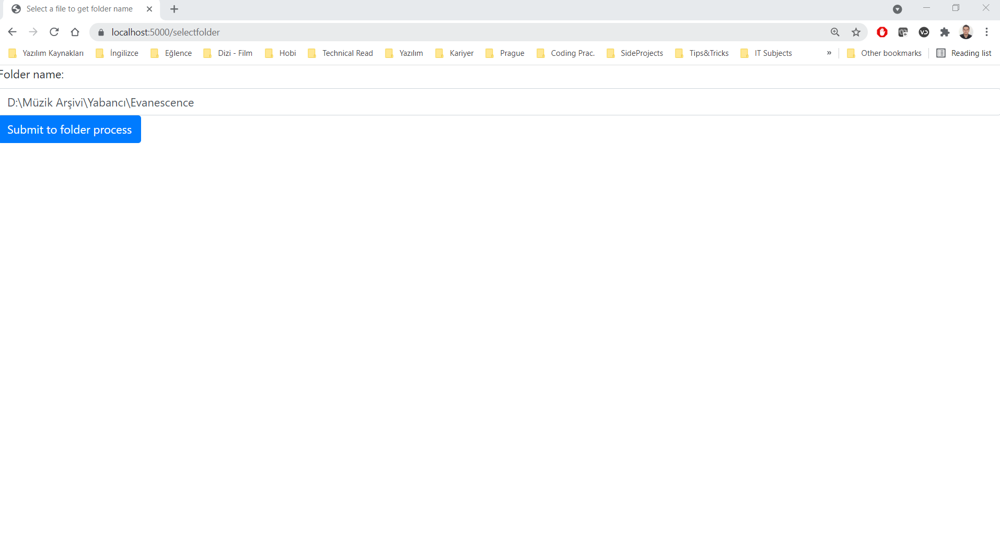
Folder successfully processed and added tracks displayed on browser.
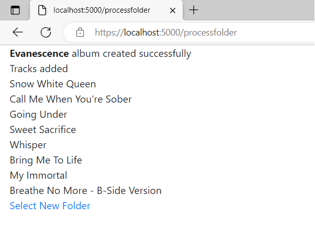

You can see Spotify List on Spotify itself. That's the magic :)
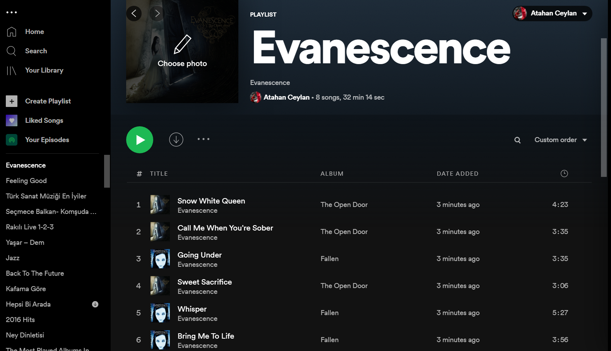
